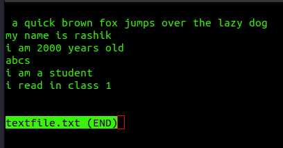

# View File Contents Page by Page

The less command is a powerful file pager that allows you to view (but not edit) the contents of a file one screen at a time. It's especially useful for reading large files, logs, or command outputs without overwhelming your terminal. Unlike some other pagers, less does not need to read the entire file before starting, making it efficient for large files.

## Syntex:

<pre>

less [options] [file]
</pre>

## Basic usage:

<pre>

less filename.txt
</pre>

## Example:

+ #### Viewing a file:

##### Input:
<pre>

less textfile.txt
</pre>

##### Output:

+ #### Navigating Through the File

    + Scroll Down One Line: Press j or the down arrow key.
    + Scroll Up One Line: Press k or the up arrow key.
    + Scroll Down One Page: Press Space or Page Down.
    + Scroll Up One Page: Press b or Page Up.
    + Go to the Beginning of the File: Press g.
    + Go to the End of the File: Press G.

+ #### Searching Within a File

    + ##### Forward Search: Press /, type the search term, and press Enter.

    <pre>

    /word
    </pre>

    This searches for the next occurrence of the word "error".

    + ##### Backward Search: Press ?, type the search term, and press Enter.
    <pre>

    ?word
    </pre>

    This searches for the previous occurrence of the word "warning".

    + Repeat Search: Press n to repeat the search in the same direction or N to search in the opposite direction.